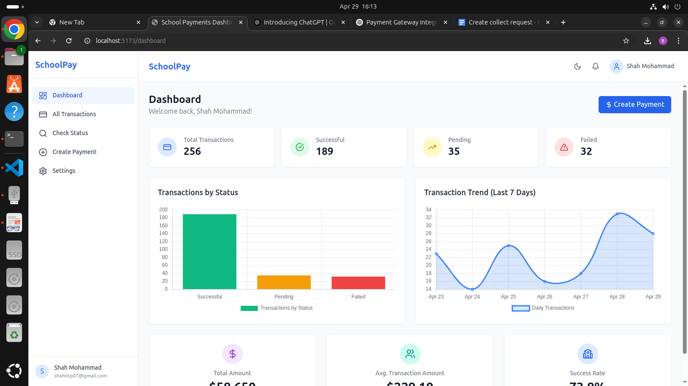
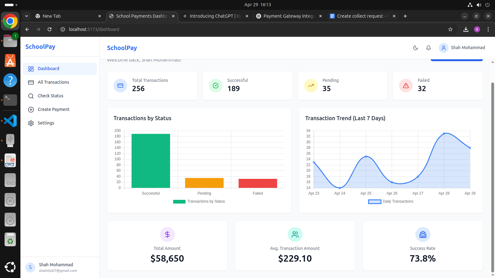
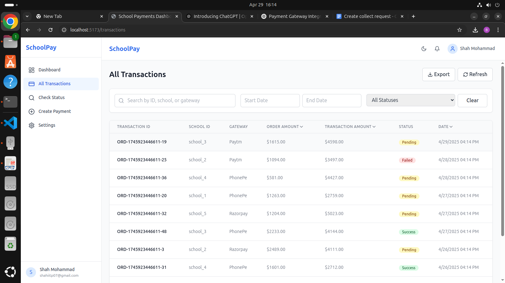
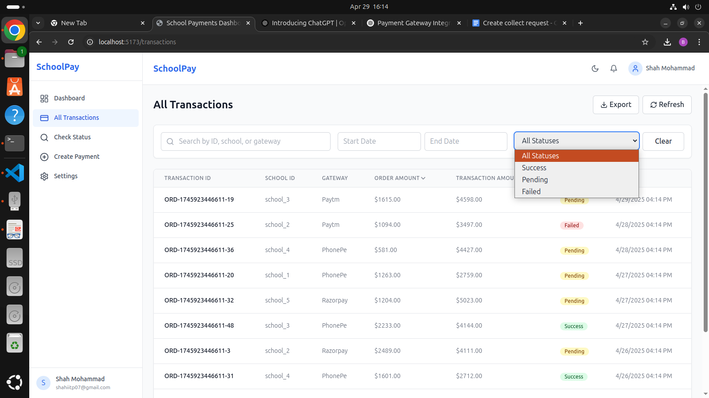
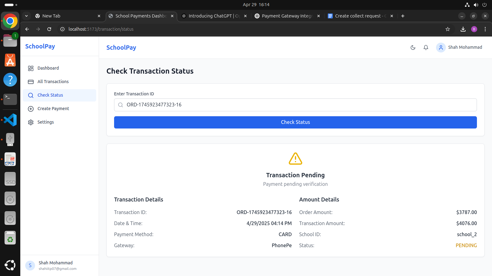
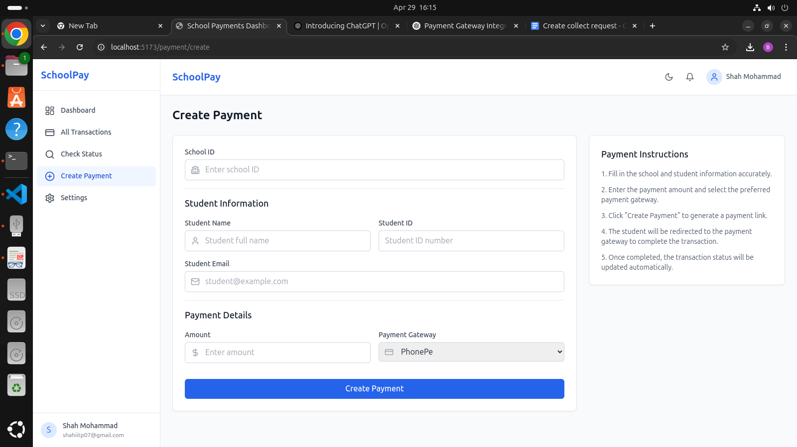

# School Pay

A scalable full-stack application for managing school transactions and payments via a secure and intuitive dashboard.


## Demo Screenshots

<div align="center">
  
  
  
  <br/>
  
  
  
</div>


##  Features

- JWT-based secure login system
- Payment Gateway integration with create-collect-request
- MongoDB Atlas database with Mongoose schemas
- Order and Transaction Management
- Webhook to update transaction statuses dynamically
- Comprehensive RESTful APIs:
  - Fetch all transactions (with pagination, sorting, filtering)
  - Fetch by school ID
  - Check transaction status
- Admin Dashboard (Frontend):
  - Transaction list with filters and sorting
  - Transaction details by school
  - Status check interface
- Responsive UI with Tailwind CSS
- Optional (Extra Credit):
  - Real-time data updates
  - Dark/Light mode toggle

## 🧩 JSON Schemas Used

### 1. Order Schema
```json
{
  "_id": "ObjectId",
  "school_id": "ObjectId/string",
  "trustee_id": "ObjectId/string",
  "student_info": {
    "name": "string",
    "id": "string",
    "email": "string"
  },
  "gateway_name": "string"
}
```

### 2\. Order Status Schema

```json
{
  "collect_id": "ObjectId",
  "order_amount": "number",
  "transaction_amount": "number",
  "payment_mode": "string",
  "payment_details": "string",
  "bank_reference": "string",
  "payment_message": "string",
  "status": "string",
  "error_message": "string",
  "payment_time": "Date"
}
```

### 3\. Webhook Log Schema

```json
{
  "status": "number",
  "order_info": {
    "order_id": "string",
    "order_amount": "number",
    "transaction_amount": "number",
    "gateway": "string",
    "bank_reference": "string",
    "status": "string",
    "payment_mode": "string",
    "payemnt_details": "string",
    "Payment_message": "string",
    "payment_time": "Date",
    "error_message": "string"
  }
}
```

## ⚙️ Setup & Installation

### Clone the repository:

```bash
git clone [https://github.com/yourusername/school-pay.git](https://github.com/yourusername/school-pay.git)
cd school-pay
```

Set up your environment variables (see .env section below).

### Backend: 

```bash
cd backend
npm install
```

### Start the Backend Server:
```bash
npm run start:dev
```

### Frontend:

```bash
cd frontend
npm install
```

### Run the frontend application:
```bash
npm run dev
```

## 🔗 API Usage Examples

### 1\. Create Payment

```http
POST /create-payment
Authorization: Bearer <JWT>
Content-Type: application/json

{
  "order_amount": 2200,
  "student_info": {
    "name": "John Doe",
    "id": "S123",
    "email": "john@example.com"
  }
}
```

### 2\. Webhook Listener

```http
POST /webhook
Content-Type: application/json

{
  "status": 200,
  "order_info": {
    "order_id": "order123",
    "order_amount": 2000,
    "transaction_amount": 2200,
    "gateway": "PhonePe",
    "bank_reference": "YESBNK222",
    "status": "success",
    "payment_mode": "upi",
    "payemnt_details": "success@ybl",
    "Payment_message": "payment success",
    "payment_time": "2025-04-23T08:14:21.945+00:00",
    "error_message": "NA"
  }
}
```

## 🛠️ Environment Variables

Create a `.env` file in your backend root with the following:

```bash
MONGO_URI=mongodb+srv://<your-uri>
JWT_SECRET=your_jwt_secret
JWT_EXPIRY=3600s
PG_KEY=edvtest01
PAYMENT_API_KEY=eyJhbGciOiJIUzI1NiIsInR5cCI6IkpXVCJ9...
SCHOOL_ID=65b0e6293e9f76a9694d84b4
```

## 🧪 Postman Collection

Download the Postman collection [here](https://www.google.com/search?q=link-to-postman-collection).

## 📌 This project is hosted live at:

Backend: https://your-backend-url.com

Frontend: https://your-frontend-url.netlify.app